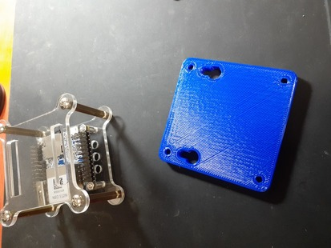
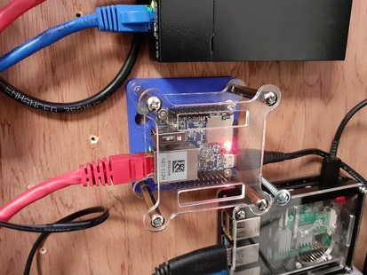
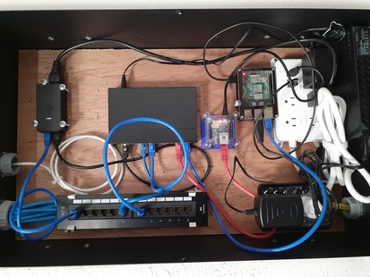

# NanoPi NEO/NEO2/Air Wall Mount Bracket

A simple 3D printed wall mount bracket for a NanoPi NEO/NEO2/Air in its cheap official acrylic case.

I needed to mount a NanoPi NEO into a wiring cabinet.
The NanoPi was destined to be a Mosquitto MQTT server for my IoT devices around the home.
The small form factor and sufficient resources would do the job admirably.
After putting Armbian on it and setting a static DHCP record, it was ready for use.

To mount the board, I used the official case from Friendly Elec.
The footings of the case are M3 threaded.
I decided to use M3 internal hex head bolts, 4mm in length to attach the case to the 3D printed mounting board.

The cabinet has a plywood back, so I'm using a couple of flat head screws to mount it to the backing board.

The 3D model was created in FreeCAD, exported as an stl to be sliced by Cura, and printed on a Creality Ender 3 Pro. The filment is Hatchbox.

* [Main board](https://www.friendlyelec.com/index.php?route=product/product&product\_id=132)
* [Case](https://www.friendlyelec.com/index.php?route=product/product&path=90&product\_id=153)
* [M3 screws](https://www.amazon.com/uxcell-Socket-Machine-Screws-Black/dp/B00W97L09W)

Images of the print and install are in the images directory.

Creator: Aaron S. Crandall  
Contact: <crandall@gonzaga.edu>  
Copyright: 2022  

* * *

